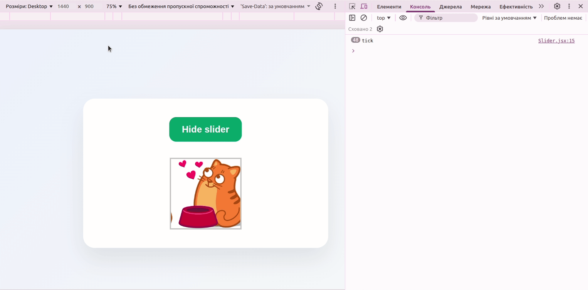

# React Image Slider
## Live Demo
[View Live Site](https://image-slider-react-use-effect.vercel.app/)

A small React project that displays an automatic image slider. The slider moves to the next image every 2 seconds and can be shown or hidden with a button.

This project was built to practice `useState`, `useEffect`, conditional rendering, component structure, and cleanup logic in React.



## Features
- Automatic image slider
- Show / hide slider button
- Smooth slide transition
- Conditional rendering with React state
- `useEffect` with `setInterval`
- Cleanup function with `clearInterval`
- Simple responsive layout

## Tech Stack
- React
- Vite
- JavaScript
- CSS
- normalize.css

## What I Used
- `useState` to store the slider position and control whether the slider is visible
- `useEffect` to start the automatic slider interval when the `Slider` component is rendered
- Cleanup function inside `useEffect` to clear the interval when the component is hidden or unmounted
- Conditional rendering to show or hide the `Slider` component
- CSS transitions to animate the slider movement

## Why `useEffect` Is Used
In this project, `useEffect` is used to start an automatic slider after the `Slider` component appears on the screen. It creates an interval that updates the slide position every 2 seconds. The cleanup function clears the interval when the `Slider` component is hidden or removed from the page.

Every 2 seconds, the interval updates the slider position by changing the `left` state. When the state changes, React re-renders the component and the image line moves to the next slide.

The cleanup function is used to clear the interval when the `Slider` component is hidden or unmounted. This prevents the timer from continuing to run in the background and avoids unnecessary state updates or memory leaks.

```jsx
useEffect(() => {
  const interval = setInterval(() => {
    setLeft(prevLeft =>
      prevLeft - frameWidth > -frameWidth * slidesCount
        ? prevLeft - frameWidth
        : 0
    );
  }, 2000);

  return () => clearInterval(interval);
}, []);
```

## How It Works
The main `App` component stores a boolean state called `show`. When the user clicks the button, the state changes and the slider is either displayed or removed from the page.

```jsx
{show && <Slider />}
```
Inside the `Slider` component, another state value stores the current horizontal position of the image line. The position changes automatically every 2 seconds.

## Getting Started
### 1. Clone the repository

```bash
git clone https://github.com/antonina-kachusova/Image-Slider-React-UseEffect.git
cd react-image-slider
```

### 2. Install dependencies
```bash
npm install
```

### 3. Run the project locally
```bash
npm run dev
```

### 4. Build for production
```bash
npm run build
```

## Scripts
```bash
npm run dev       # Start development server
npm run build     # Build production version
npm run lint      # Run ESLint
npm run preview   # Preview production build locally
```

## Project Structure
```text
react-image-slider/
├── public/
│   ├── images/
│   │   ├── cat_1.png
│   │   ├── cat_2.png
│   │   ├── cat_3.png
│   │   └── cat_4.png
│   └── normalize.css
├── src/
│   ├── App.jsx
│   ├── App.css
│   ├── Slider.jsx
│   ├── Slider.css
│   ├── index.jsx
│   └── index.css
├── index.html
├── package.json
├── package-lock.json
├── vite.config.js
├── eslint.config.js
├── .gitignore
└── README.md
```
## Notes
This is a learning project focused on understanding how `useEffect` works with intervals and cleanup. In real projects, cleanup is important when working with timers, subscriptions, event listeners, or any side effects that should stop when a component is removed from the page.
